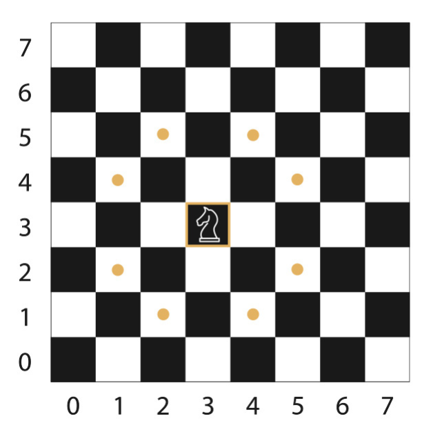

# Knights Travails

Given enough turns, a knight on a standard 8x8 chess board can move from any square to any other square. Its basic move is two steps forward and one step to the side or one step forward and two steps to the side. It can face any direction.

All the possible places a knight can end up after one move look like this:

## Challenge

Using a graph data structure, write a `knightMoves` function that shows the shortest possible way to get from one square to another by outputting all squares the knight will stop on along the way.
